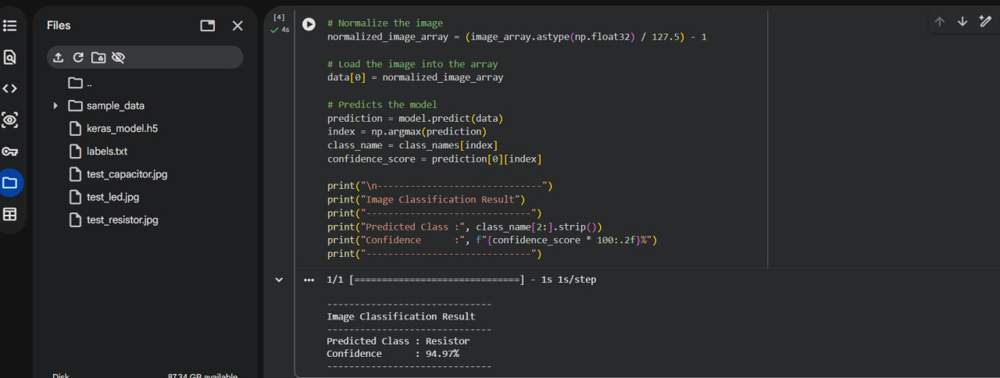
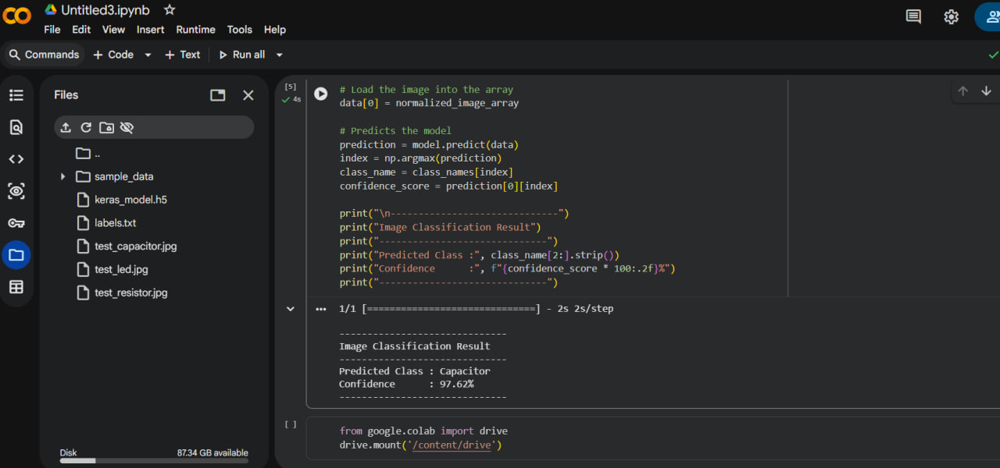
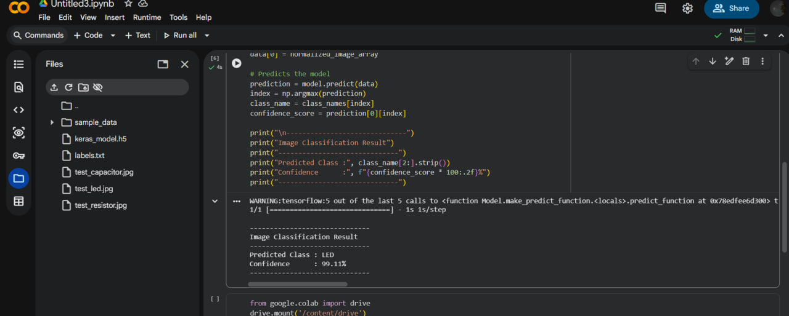

# Electronic Component Image Classifier

This project is an image classification task developed using **Google Teachable Machine** and tested using **Python in Google Colab**.

The model was trained to recognize three types of electronic components:

* LED
* Resistor
* Capacitor

After training, the model was exported in **TensorFlow → Keras** format and tested with an image from each class. The final prediction and confidence score were displayed using a Python script.

---

## 1. Creating the Image Classification Model

The first step was to create an **Image Project** using Google Teachable Machine.

Three classes were created:

```text
LED
Resistor
Capacitor
```

Images of each electronic component were added to their corresponding class.

The model was then trained using the **Train Model** option in Teachable Machine.

---

## 2. Training the Model

After preparing the three classes and adding their images, the image classification model was trained directly in Teachable Machine.

The purpose of the training process was to allow the model to learn the visual differences between:

* LEDs
* Resistors
* Capacitors

After the training was completed, the model was tested through the Teachable Machine preview before being exported.

---

## 3. Exporting the Trained Model

After completing the training process, the model was exported from Teachable Machine using:

```text
TensorFlow → Keras
```

The exported model contained two main files:

```text
keras_model.h5
labels.txt
```

### `keras_model.h5`

Contains the trained image classification model.

### `labels.txt`

Contains the names of the classes used during training:

```text
LED
Resistor
Capacitor
```

These files were then used to run the model outside Teachable Machine.

---

## 4. Testing the Model in Google Colab

Google Colab was used to run the exported model with Python.

The following files were uploaded to the Colab environment:

```text
keras_model.h5
labels.txt
test image
```

The model file and labels file were loaded into the Python code.

Because of the Keras version compatibility used with the exported Teachable Machine model, the model was loaded using:

```python
import tf_keras as tk

model = tk.models.load_model("keras_model.h5", compile=False)
```

The labels were loaded from:

```python
class_names = open("labels.txt", "r").readlines()
```

---

## 5. Preparing the Input Image

Before the image could be passed to the model, it had to be prepared in the same format expected by the trained model.

The test image was first opened and converted to RGB:

```python
image = Image.open("test_led.jpg").convert("RGB")
```

The image was then resized to:

```text
224 × 224 pixels
```

using:

```python
size = (224, 224)
image = ImageOps.fit(image, size, Image.Resampling.LANCZOS)
```

After resizing, the image was converted into a NumPy array.

```python
image_array = np.asarray(image)
```

The pixel values were then normalized before being passed to the model:

```python
normalized_image_array = (image_array.astype(np.float32) / 127.5) - 1
```

The processed image was added to the model input array.

```python
data[0] = normalized_image_array
```

---

## 6. Running the Prediction

After preparing the input image, the trained model was used to generate a prediction.

```python
prediction = model.predict(data)
index = np.argmax(prediction)
```

The index with the highest prediction value was selected.

The corresponding class name and confidence score were then retrieved:

```python
class_name = class_names[index]
confidence_score = prediction[0][index]
```

The final result was displayed as:

```text
------------------------------
Image Classification Result
------------------------------
Predicted Class : LED
Confidence      : 99.11%
------------------------------
```

---

## 7. Testing All Classes

The model was tested with an image from each of the three classes.

### Resistor Test

The resistor image was classified as:

```text
Predicted Class : Resistor
Confidence      : 94.97%
```

**Result: Correct**

---

### Capacitor Test

The capacitor image was classified as:

```text
Predicted Class : Capacitor
Confidence      : 97.62%
```

**Result: Correct**

---

### LED Test

The LED image was classified as:

```text
Predicted Class : LED
Confidence      : 99.11%
```

**Result: Correct**

---

## 8. Model Evaluation

The results of the three tests were:

| Actual Class | Predicted Class | Confidence | Result  |
| ------------ | --------------- | ---------: | ------- |
| Resistor     | Resistor        |     94.97% | Correct |
| Capacitor    | Capacitor       |     97.62% | Correct |
| LED          | LED             |     99.11% | Correct |

The model correctly classified all three test images.

```text
Correct Predictions: 3 / 3
```

---

## 9. Prediction Screenshots

### Resistor

**Prediction:** Resistor
**Confidence:** 94.97%



### Capacitor

**Prediction:** Capacitor
**Confidence:** 97.62%



### LED

**Prediction:** LED
**Confidence:** 99.11%



---

## 10. Project Structure

The project files were organized into separate folders for the model, test images, source code, and results.

```text
electronic-component-image-classifier/
│
├── model/
│   ├── keras_model.h5
│   └── labels.txt
│
│── results/
│   ├── led_result.jpg
│   ├── resistor_result.jpg
│   └── capacitor_result.jpg
│
├── src/
│   └── predict.py
│
├── test_images/
│   ├── test_led.jpg
│   ├── test_resistor.jpg
│   └── test_capacitor.jpg
│
└── README.md
```

---

## 11. Tools Used

* Google Teachable Machine
* Google Colab
* Python
* TensorFlow / Keras
* NumPy

---

## Final Result

The image recognition model was successfully trained, exported, and tested.

It successfully recognized all three electronic component classes:

```text
LED        → 99.11%
Resistor   → 94.97%
Capacitor  → 97.62%
```

The model files, Python script, test images, and prediction results are included in this repository.
